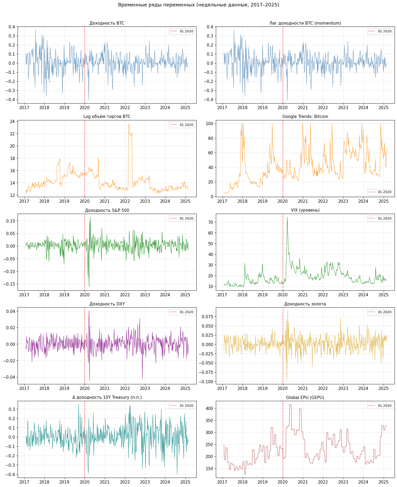
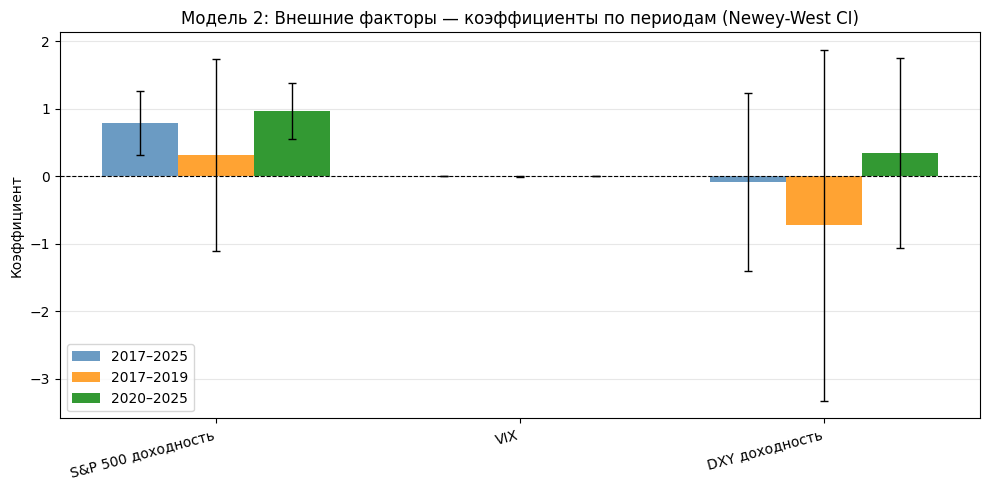
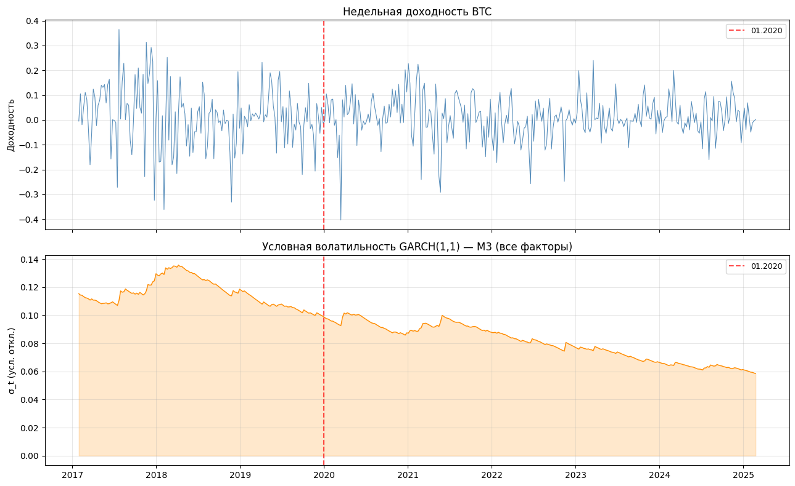

# Сравнение роли крипто-специфических и внешних рыночных факторов доходности Bitcoin на разных этапах развития рынка

## Краткое описание

Этот репозиторий содержит исследовательский пайплайн для анализа недельной доходности Bitcoin и сравнения двух групп факторов: crypto-specific factors и external market factors. Основная задача состоит в том, чтобы оценить, какая группа факторов лучше объясняет доходность Bitcoin в целом и меняется ли относительная роль этих факторов при переходе от менее зрелого этапа рынка (`2017–2019`) к более зрелому этапу (`2020–2025`).

## Исследовательский вопрос и гипотезы

Исследовательский вопрос: объясняется ли недельная доходность Bitcoin в большей степени внутренними криптовалютными факторами или внешними рыночными факторами, и как это соотношение меняется по мере зрелости рынка.

- `H1`: crypto-specific факторы лучше объясняют доходность Bitcoin, чем внешние рыночные факторы.
- `H2`: в период `2020–2025` значимость внешних рыночных факторов возрастает, а относительная роль crypto-specific факторов снижается.

## Данные и переменные

Итоговый недельный датасет находится в [data/processed/merged_weekly.csv](data/processed/merged_weekly.csv).

| Категория | Переменная | Обозначение в данных | Описание |
| --- | --- | --- | --- |
| Зависимая переменная | Доходность Bitcoin | `r_btc` | Недельная логарифмическая доходность Bitcoin |
| Crypto-specific | Лаг доходности Bitcoin | `r_btc_lag` | Прокси для momentum |
| Crypto-specific | Объем торгов Bitcoin | `log_volume_btc` | Логарифм недельного объема торгов |
| Crypto-specific | Внимание инвесторов | `google_trends` | Google Trends по запросу `Bitcoin` |
| External | Доходность S&P 500 | `r_sp500` | Недельная логарифмическая доходность индекса S&P 500 |
| External | Рыночная волатильность | `vix` | Значение индекса VIX |
| External | Индекс доллара США | `r_dxy` | Недельная логарифмическая доходность DXY |
| External (расшир.) | Доходность золота | `r_gold` | Недельная лог-доходность золота (Investing.com) |
| External (расшир.) | Изменение доходности UST 10Y | `d_yield_10y` | Недельное изменение доходности 10-летних UST, п.п. (FRED) |
| External (расшир.) | Глобальная неопределённость экон. политики | `epu` | Global Economic Policy Uncertainty Index, помесячно (policyuncertainty.com) |

- Частота данных: weekly.
- Полный период выборки: `2017-01-29` to `2025-02-23`.
- Число наблюдений: `422`.
- Подпериод 1: `2017-01-29` to `2019-12-29`, `153` наблюдения.
- Подпериод 2: `2020-01-05` to `2025-02-23`, `269` наблюдений.
- Формально второй подпериод обозначается как `2020–2025`, но фактически в данных он заканчивается `2025-02-23`.
- В итоговом датасете отсутствуют пропуски по всем использованным переменным.



## Структура репозитория

```
diploma_bitcoin_research/
├── README.md            # обзор проекта (этот файл)
├── STYLE_GUIDE.md       # правила оформления ВКР по методичке РАНХиГС
│
├── data/                # данные
│   ├── raw/             # исходные CSV (BTC, S&P 500, VIX, DXY, GT, gold, DGS10, EPU)
│   └── processed/       # итоговый недельный датасет и сохранённые графики
│
├── notebooks/           # аналитический пайплайн (Jupyter)
│   ├── 01_data_collection.ipynb
│   ├── 02_eda.ipynb
│   ├── 03_regression_analysis.ipynb
│   ├── 04_garch_robustness.ipynb
│   ├── 05_rolling_window.ipynb
│   └── 06_quantile_regression.ipynb
│
├── thesis/              # текст ВКР по главам (Markdown)
│   ├── 00_metadata.md
│   ├── 01_introduction.md
│   ├── 02_chapter1_literature.md
│   ├── 03_chapter2_methodology.md
│   ├── 04_chapter3_results.md
│   ├── 05_conclusion.md
│   └── references.md
│
├── docs/                # справочные материалы
│   └── ВАЖНО_оформление_НИР_и_ВКР_версия_2023.pdf
│
└── .cursor/rules/       # правила для AI-ассистента при написании диплома
    └── thesis-writing.mdc
```

Назначение ноутбуков:

- [notebooks/01_data_collection.ipynb](notebooks/01_data_collection.ipynb) — загрузка, очистка и агрегация сырых данных до недельной частоты (включая gold, DGS10, EPU).
- [notebooks/02_eda.ipynb](notebooks/02_eda.ipynb) — описательная статистика, корреляции, тесты стационарности, VIF и диагностические графики.
- [notebooks/03_regression_analysis.ipynb](notebooks/03_regression_analysis.ipynb) — OLS-оценка М1–М4 с Newey-West SE, сравнение по периодам.
- [notebooks/04_garch_robustness.ipynb](notebooks/04_garch_robustness.ipynb) — GARCH(1,1) как проверка устойчивости для М1–М4.
- [notebooks/05_rolling_window.ipynb](notebooks/05_rolling_window.ipynb) — rolling window OLS (52 недели) для М4.
- [notebooks/06_quantile_regression.ipynb](notebooks/06_quantile_regression.ipynb) — квантильная регрессия М4 для τ ∈ {0.10, 0.25, 0.50, 0.75, 0.90}.

## Методология

Основная эмпирическая часть построена на четырёх OLS-спецификациях, где зависимой переменной выступает `r_btc`.

- Модель 1: только crypto-specific факторы (`r_btc_lag`, `log_volume_btc`, `google_trends`).
- Модель 2: только базовые external market factors (`r_sp500`, `vix`, `r_dxy`).
- Модель 3: обе группы базовых факторов одновременно.
- Модель 4 (расширенная): М3 + `r_gold`, `d_yield_10y`, `epu`.

Для основной интерпретации используются HAC / Newey-West стандартные ошибки, корректирующие оценки на гетероскедастичность и автокорреляцию. Дополнительно применяются:

- **GARCH(1,1)** — robustness-check на кластеризацию волатильности;
- **Rolling window OLS** (окно 52 недели) — непрерывная динамика коэффициентов во времени;
- **Квантильная регрессия** (τ ∈ {0.10, 0.25, 0.50, 0.75, 0.90}) — неоднородность связи в хвостах распределения.

Перед оцениванием моделей выполнены базовые диагностические проверки:

- Все итоговые переменные стационарны по ADF-тестам (кроме уровня `epu`: ADF p = 0.085 — см. Ограничения).
- Серьезной мультиколлинеарности не выявлено: VIF по полной модели М4 в диапазоне `1.0–1.7`.
- В остатках OLS-моделей присутствуют ARCH-эффекты, поэтому использование GARCH как проверки устойчивости оправдано.

## Ключевые эмпирические результаты

### Сравнение моделей на полном периоде

| Модель | Спецификация | `R²` | `Adj. R²` |
| --- | --- | ---: | ---: |
| М1 | Только crypto-specific факторы | `0.0092` | `0.0021` |
| М2 | Только внешние факторы | `0.0441` | `0.0373` |
| М3 | Все факторы | `0.0476` | `0.0338` |
| М4 | Расширенная (М3 + gold, Δ10Y, EPU) | `0.0522` | — |

На полном периоде внешние рыночные факторы объясняют доходность Bitcoin заметно лучше, чем crypto-specific блок. Расширенная модель М4 последовательно превосходит М3 во всех периодах, хотя прирост в абсолютном выражении невелик.

### Сравнение моделей по подпериодам

| Модель | `R²` в `2017–2019` | `R²` в `2020–2025` |
| --- | ---: | ---: |
| М1: crypto-specific | `0.0096` | `0.0245` |
| М2: external | `0.0194` | `0.0893` |
| М3: все факторы | `0.0248` | `0.1016` |
| М4: расширенная | `0.0432` | `0.1131` |

Разрыв между внешними и crypto-specific факторами особенно заметен во втором подпериоде. Если в `2017–2019` объясняющая сила всех моделей остается низкой, то в `2020–2025` именно блок внешних факторов показывает наиболее заметный рост `R²`. Rolling window OLS подтверждает, что рост β при `r_sp500` начался в 2020 году и носил постепенный, а не разрывной характер.

### Интерпретация коэффициентов

- В OLS на полном периоде статистически значимым фактором в моделях `М2`–`М4` выступает `r_sp500` (β ≈ 0.75, p < 0.01, Newey–West SE).
- В подпериоде `2020–2025` коэффициент при `r_sp500` остается статистически значимым и усиливается (β ≈ 0.89 в М4).
- `r_gold` — положительный коэффициент во всех периодах (β ≈ 0.38–0.63), но без устойчивой статистической значимости на 5%-уровне.
- `d_yield_10y` и `epu` — малые и незначимые оценки во всех спецификациях.
- В `М1` переменная momentum (`r_btc_lag`) показывает лишь слабый сигнал и не становится основным объясняющим фактором.
- Переменные `vix`, `r_dxy`, `log_volume_btc` и `google_trends` в текущей спецификации не демонстрируют устойчивой статистической значимости.
- **Квантильная регрессия** выявила выраженную асимметрию для `r_sp500`: в нижнем хвосте (τ = 0.10) β ≈ 1.10 на полном периоде и ≈ 1.70 в `2020–2025` — в стрессовые недели Bitcoin движется значительно сильнее рынка акций; в верхнем хвосте (τ = 0.90) связь почти исчезает.



### Что произошло с гипотезами

- `H1` **отвергается**: на текущей выборке external market factors объясняют доходность Bitcoin лучше, чем crypto-specific factors — вывод подтверждается по всем четырём моделям.
- `H2` **поддерживается**: в период `2020–2025` роль внешних рыночных факторов заметно возрастает; rolling window OLS показывает плавный рост β(`r_sp500`) начиная с 2020 года; квантильная регрессия уточняет: усиление произошло прежде всего в нижнем хвосте распределения доходности.

## Основные выводы

- На текущей выборке внешние рыночные факторы объясняют доходность Bitcoin лучше, чем crypto-specific переменные.
- Основной устойчивый драйвер среди внешних факторов — доходность `S&P 500`; вывод устойчив по OLS, GARCH(1,1) и rolling window.
- После `2020` года чувствительность Bitcoin к внешней рыночной среде усиливается — и это постепенный, а не разрывной процесс.
- Усиление связи с `S&P 500` концентрируется в нижнем хвосте доходности: в стрессовые недели Bitcoin двигается вместе с акциями сильнее, чем в недели роста.
- Золото (`r_gold`) — положительная, но незначимая связь на еженедельном горизонте; гипотеза «digital gold» не опровергается, но и не подтверждается статистически.
- `d_yield_10y` и `epu` не объясняют краткосрочную доходность Bitcoin на еженедельной частоте.
- В используемой спецификации momentum, торговый объем и Google Trends не показывают сопоставимой объясняющей силы.
- Даже лучшая модель (М4) обладает умеренной объясняющей силой, поэтому результаты следует интерпретировать как сравнительные, а не как исчерпывающее объяснение динамики Bitcoin.

## Robustness

### GARCH(1,1)

В [notebooks/04_garch_robustness.ipynb](notebooks/04_garch_robustness.ipynb) GARCH(1,1) используется как дополнительная проверка устойчивости для всех четырёх моделей (М1–М4), а не как основная модель исследования.

- ARCH-эффекты в остатках OLS действительно присутствуют.
- GARCH подтверждает устойчивую значимость `S&P 500` на полном периоде (β ≈ 83.55×, p < 0.001) и в подпериоде `2020–2025` (β ≈ 101.22×, p < 0.001) — знаки и порядок коэффициентов полностью согласуются с OLS.
- Высокая персистентность волатильности (α + β ≈ 0.997) типична для криптоактивов; ковариационная стационарность сохраняется.



### Rolling window OLS

В [notebooks/05_rolling_window.ipynb](notebooks/05_rolling_window.ipynb) модель М4 оценивается на скользящем окне шириной 52 недели (371 точка).

- β по `r_sp500` начал расти в 2020 году и удерживается на повышенных значениях весь второй подпериод — это плавный, а не разрывной процесс.
- β по `vix` колеблется вокруг нуля на всём горизонте.
- β по `r_gold` становится устойчиво положительным с 2020–2021 года, хотя CI практически всегда пересекает ноль.

### Квантильная регрессия

В [notebooks/06_quantile_regression.ipynb](notebooks/06_quantile_regression.ipynb) модель М4 оценивается для τ ∈ {0.10, 0.25, 0.50, 0.75, 0.90}.

- В нижнем хвосте (τ = 0.10) β по `r_sp500` ≈ 1.10 на полном периоде и ≈ 1.70 в `2020–2025`.
- В верхнем хвосте (τ = 0.90) β по `r_sp500` ≈ 0.02–0.42 — связь почти исчезает в недели роста.
- Корреляция с акциями сильнее в стрессе, чем в бычьей фазе; pooled OLS «смазывает» этот эффект.

## Ограничения

- Выборка ограничена периодом до `2025-02-23`.
- Переменная Google Trends является относительным индексом внимания, а не абсолютной мерой интереса инвесторов.
- Объясняющая сила моделей остается в целом низкой, даже в лучшей спецификации (М4 R² ≈ 0.05 на полном периоде).
- Результаты чувствительны к выбранной частоте данных и к набору факторов.
- `epu` формально нестационарен на 5%-уровне (ADF p = 0.085); в строгой постановке следовало бы использовать первую разность; внутримесячный look-ahead при prокидывании месячного значения на недели допустим для контемпоранерной OLS, но исключает прогнозное применение.
- Модель М4 на подпериоде P1 (N = 153) имеет 9 регрессоров; Adj. R² уходит в отрицательную область → интерпретировать с осторожностью.
- В проекте рассматривается ограниченный набор традиционных рыночных переменных; включение on-chain метрик и альтернативных макрофакторов может изменить выводы.

## Как воспроизвести

Проект организован как последовательность Jupyter notebooks. Отдельного `requirements.txt` в репозитории нет, поэтому зависимости нужно установить вручную.

### Среда

- Python
- `pandas`
- `numpy`
- `matplotlib`
- `seaborn`
- `scipy`
- `statsmodels`
- `arch`

### Порядок запуска

1. [notebooks/01_data_collection.ipynb](notebooks/01_data_collection.ipynb)
2. [notebooks/02_eda.ipynb](notebooks/02_eda.ipynb)
3. [notebooks/03_regression_analysis.ipynb](notebooks/03_regression_analysis.ipynb)
4. [notebooks/04_garch_robustness.ipynb](notebooks/04_garch_robustness.ipynb)
5. [notebooks/05_rolling_window.ipynb](notebooks/05_rolling_window.ipynb)
6. [notebooks/06_quantile_regression.ipynb](notebooks/06_quantile_regression.ipynb)

Если используется уже подготовленный датасет [data/processed/merged_weekly.csv](data/processed/merged_weekly.csv), можно начинать с EDA и регрессионного анализа (шаги 2–6).
