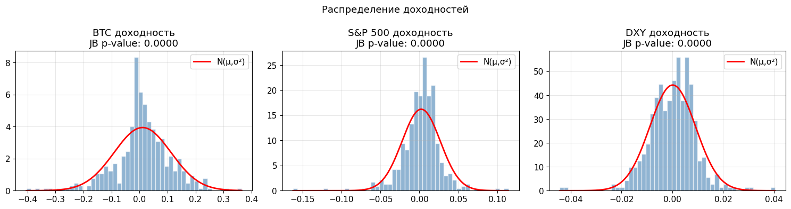

# 2 Данные и методология

Глава посвящена описанию информационной базы исследования, составу и обоснованию переменных, результатам предварительного диагностического анализа, а также спецификации эконометрических моделей. Приведённые здесь характеристики данных и методологические решения служат основой для интерпретации результатов, представленных в главе 3.

## 2.1 Данные и переменные

### 2.1.1 Описание выборки и источники

В работе использован набор еженедельных наблюдений за период с 29 января 2017 года по 23 февраля 2025 года (n = 422). Начало выборки определяется доступностью согласованных данных по всем переменным; конечная точка соответствует дате формирования датасета. Выборка разделена на два подпериода: 2017–2019 (n = 153 недели) и 2020–2025 (n = 269 недель). Граница между ними проведена по началу 2020 года, что согласуется с датировкой структурного сдвига в корреляционной структуре Bitcoin, выявленного в литературе (Шилов, Зубарев, 2021; Синельникова-Мурылева и др., 2022).

Крипто-специфические переменные (цена и объём торгов Bitcoin) получены с платформы Investing.com. Исходные дневные данные агрегированы до недельной частоты: цена использовалась как цена закрытия пятницы, объём суммировался за неделю с последующим логарифмированием. Данные Google Trends доступны в недельной частоте непосредственно. Внешние финансовые переменные (S&P 500, VIX, DXY) также получены с Investing.com; для S&P 500 и DXY рассчитаны недельные лог-доходности, для VIX использовано значение на конец недели.

Использование недельной частоты наблюдений обусловлено тремя соображениями. Во-первых, недельная агрегация снижает влияние краткосрочного шума, характерного для высокочастотных криптовалютных данных. Во-вторых, она обеспечивает единообразное сопоставление Bitcoin с традиционными рыночными индикаторами. В-третьих, при n = 422 статистическая мощность оказывается достаточной для анализа полного периода и двух подпериодов (n = 153 и n = 269) без существенной потери точности оценок. Итоговый датасет не содержит пропущенных наблюдений.

### 2.1.2 Состав переменных

*Таблица 2.1 — Описание переменных*

| Переменная | Обозначение | Тип | Источник |
| --- | --- | --- | --- |
| Логарифмическая доходность Bitcoin | $r_{BTC}$ | зависимая | Investing.com |
| Лаг доходности Bitcoin на 1 неделю | $r_{BTC,t-1}$ | крипто-специфич. | расчёт |
| Лог объёма торгов Bitcoin | $\ln V_{BTC}$ | крипто-специфич. | Investing.com |
| Индекс Google Trends («Bitcoin») | $GT$ | крипто-специфич. | Google Trends |
| Логарифмическая доходность S&P 500 | $r_{SP500}$ | внешний | Investing.com |
| Индекс волатильности VIX | $VIX$ | внешний | Investing.com |
| Логарифмическая доходность DXY | $r_{DXY}$ | внешний | Investing.com |

**Зависимая переменная.** Логарифмическая доходность Bitcoin рассчитана по формуле:

$$
r_{BTC,t} = \ln\!\left(\frac{P_t}{P_{t-1}}\right) \tag{2.1}
$$

где $P_t$ — цена закрытия пятницы недели $t$.

**Крипто-специфический блок** включает три переменные. Лаг доходности $r_{BTC,t-1}$ служит прокси ценового моментума: если текущая доходность частично определяется прошлой, это свидетельствует о нарушении слабой формы эффективности рынка. Переменная $\ln V_{BTC,t}$ отражает еженедельную торговую активность и интерпретируется как показатель ликвидности и интенсивности спекулятивного интереса. Индекс $GT_t$ нормирован по шкале 0–100 и служит прокси внимания инвесторов: в отсутствие фундаментальных показателей для Bitcoin поисковый интерес приобретает самостоятельную информационную ценность (Liu, Tsyvinski, 2021).

**Блок внешних рыночных факторов** включает три переменные. Доходность S&P 500 отражает состояние глобального фондового рынка и склонность инвесторов к риску. Уровень VIX традиционно интерпретируется как индикатор рыночного страха: его рост соответствует снижению риск-аппетита. Доходность DXY характеризует динамику доллара США как резервной валюты; укрепление доллара, как правило, сопровождается оттоком капитала из рисковых активов.

### 2.1.3 Описательная статистика

*Таблица 2.2 — Описательная статистика переменных*

| Переменная | Среднее | Ст. откл. | Минимум | Максимум | Асимметрия | Эксцесс |
| --- | ---: | ---: | ---: | ---: | ---: | ---: |
| $r_{BTC}$ | 0,011 | 0,101 | −0,404 | 0,365 | −0,38 | 4,81 |
| $\ln V_{BTC}$ | 14,232 | 1,689 | 12,260 | 23,633 | 2,72 | 13,24 |
| $GT$ | 40,87 | 20,93 | 4,00 | 100,00 | 0,65 | 3,04 |
| $r_{SP500}$ | 0,002 | 0,025 | −0,162 | 0,114 | −0,93 | 10,54 |
| $VIX$ | 18,75 | 7,55 | 9,34 | 74,62 | 2,44 | 14,26 |
| $r_{DXY}$ | 0,000 | 0,009 | −0,044 | 0,040 | −0,24 | 6,02 |

*Примечание: полный период 2017–2025, n = 422. Эксцесс рассчитан в абсолютной форме (нормальное распределение = 3).*

Недельная доходность Bitcoin характеризуется средним значением 1,1% при стандартном отклонении 10,1%, что примерно в четыре раза выше, чем у S&P 500 (2,5%). Разброс доходностей крайне велик: от −40,4% до +36,5% за одну неделю. Распределение имеет выраженную отрицательную асимметрию (−0,38) и избыточный эксцесс 4,81, что указывает на более тяжёлые хвосты по сравнению с нормальным. Тест Жарка–Бера отвергает нормальность для всех переменных (p < 0,0001). Особенно выраженная нестационарность формы распределения наблюдается у $\ln V_{BTC}$ (эксцесс 13,24) и $VIX$ (эксцесс 14,26).

Сравнение подпериодов показывает умеренное снижение волатильности доходности Bitcoin: стандартное отклонение сократилось с 12,5% в 2017–2019 годах до 8,6% в 2020–2025 годах, что согласуется с тезисом о зрелости рынка. Среднее значение $GT$ выросло с 29,9 до 47,1, что отражает устойчивый рост интереса к Bitcoin. Средний уровень VIX повысился с 14,5 до 21,2, что указывает на более напряжённую внешнюю финансовую среду в более позднем подпериоде.

Динамика всех временны́х рядов на исследуемом горизонте представлена на рисунке 2.1. На рисунке отчётливо прослеживаются пики волатильности Bitcoin в 2017–2018 и 2020–2021 годах, а также выброс VIX в марте 2020 года.

*Рисунок 2.1 — Динамика переменных на полном периоде 2017–2025*

Форма распределений переменных показана на рисунке 2.2. Распределение $r_{BTC}$ характеризуется заметной островершинностью и лёгкой левосторонней асимметрией; $\ln V_{BTC}$ и $VIX$ имеют выраженные правые хвосты. Отклонения от нормального распределения, видимые на рисунке, дополнительно обосновывают применение устойчивых стандартных ошибок и GARCH(1,1).

*Рисунок 2.2 — Эмпирические распределения переменных*

## 2.2 Предварительный анализ данных

### 2.2.1 Тест на стационарность

Для каждой переменной проводился расширенный тест Дики–Фуллера (ADF) с автоматическим выбором числа лагов по критерию Акаике. Нулевая гипотеза теста: наличие единичного корня (нестационарность). Результаты представлены в таблице 2.3.

*Таблица 2.3 — Результаты ADF-теста на стационарность*

| Переменная | ADF-статистика | p-значение | Стационарна (5%) |
| --- | ---: | ---: | :---: |
| $r_{BTC}$ | −18,99 | < 0,001 | Да |
| $r_{BTC,t-1}$ | −19,02 | < 0,001 | Да |
| $\ln V_{BTC}$ | −3,64 | 0,005 | Да |
| $GT$ | −3,88 | 0,002 | Да |
| $r_{SP500}$ | −22,25 | < 0,001 | Да |
| $VIX$ | −4,85 | < 0,001 | Да |
| $r_{DXY}$ | −22,78 | < 0,001 | Да |

Все семь переменных отвергают нулевую гипотезу о единичном корне на уровне значимости 1%, то есть являются стационарными. Это устраняет риск ложной регрессии и позволяет включать переменные в OLS-спецификации в уровнях без дополнительного дифференцирования.

### 2.2.2 Корреляционный анализ

Полная матрица попарных корреляций между всеми переменными на полном периоде приведена в таблице 2.4.

*Таблица 2.4 — Матрица попарных корреляций, полный период 2017–2025 (n = 422)*

| | $r_{BTC}$ | $r_{BTC,t-1}$ | $\ln V_{BTC}$ | $GT$ | $r_{SP500}$ | $VIX$ | $r_{DXY}$ |
| --- | ---: | ---: | ---: | ---: | ---: | ---: | ---: |
| $r_{BTC}$ | 1,000 | 0,074 | −0,054 | 0,045 | **0,205** | −0,085 | −0,093 |
| $r_{BTC,t-1}$ | 0,074 | 1,000 | −0,041 | 0,120 | 0,175 | −0,171 | −0,095 |
| $\ln V_{BTC}$ | −0,054 | −0,041 | 1,000 | −0,089 | −0,081 | 0,291 | 0,088 |
| $GT$ | 0,045 | 0,120 | −0,089 | 1,000 | 0,000 | 0,058 | −0,008 |
| $r_{SP500}$ | **0,205** | 0,175 | −0,081 | 0,000 | 1,000 | −0,200 | **−0,419** |
| $VIX$ | −0,085 | −0,171 | 0,291 | 0,058 | −0,200 | 1,000 | 0,093 |
| $r_{DXY}$ | −0,093 | −0,095 | 0,088 | −0,008 | **−0,419** | 0,093 | 1,000 |

*Примечание: полужирным выделены корреляции, превышающие по модулю 0,20.*

Из таблицы 2.4 следует, что наиболее высокая попарная связь с доходностью Bitcoin наблюдается у $r_{SP500}$: 0,205 на полном периоде. Сравнение по подпериодам (таблица 2.5) показывает существенное усиление этой корреляции в 2020–2025 (0,296) по сравнению с 2017–2019 (0,079), что предварительно подтверждает гипотезу H2a. Корреляции крипто-специфических переменных умеренны. Переменные $VIX$ и $r_{DXY}$ связаны с Bitcoin отрицательно, что согласуется с теоретическими ожиданиями.

Внутри внешнего блока обращает на себя внимание корреляция $r_{SP500}$ и $r_{DXY}$: −0,419. Это не создаёт проблемы мультиколлинеарности (VIF ≤ 1,27, см. §2.2.3), однако объясняет, почему при совместном включении $r_{DXY}$ теряет самостоятельную значимость.

*Таблица 2.5 — Попарные корреляции с $r_{BTC}$ по периодам*

| Переменная | Полный период | 2017–2019 | 2020–2025 |
| --- | ---: | ---: | ---: |
| $r_{BTC,t-1}$ | 0,074 | 0,020 | 0,139 |
| $\ln V_{BTC}$ | −0,054 | −0,079 | −0,054 |
| $GT$ | 0,045 | 0,033 | 0,080 |
| $r_{SP500}$ | 0,205 | 0,079 | 0,296 |
| $VIX$ | −0,085 | −0,124 | −0,083 |
| $r_{DXY}$ | −0,093 | −0,056 | −0,123 |

### 2.2.3 Мультиколлинеарность

Для оценки мультиколлинеарности между регрессорами рассчитаны коэффициенты инфляции дисперсии (VIF) по полной модели М3 (таблица 2.6).

*Таблица 2.6 — Коэффициенты инфляции дисперсии (VIF), модель М3*

| Переменная | VIF |
| --- | ---: |
| $r_{BTC,t-1}$ | 1,07 |
| $\ln V_{BTC}$ | 1,11 |
| $GT$ | 1,03 |
| $r_{SP500}$ | 1,27 |
| $VIX$ | 1,17 |
| $r_{DXY}$ | 1,22 |

Все значения VIF существенно ниже порогового уровня 10 и свидетельствуют об отсутствии серьёзной мультиколлинеарности. Включение переменных из двух содержательно различных блоков обеспечивает их низкую попарную связанность. Наибольшее значение VIF у $r_{SP500}$ (1,27) объясняется его умеренной связью с $VIX$ и $r_{DXY}$ внутри внешнего блока.

### 2.2.4 ARCH-эффекты

Тест Энгла на наличие ARCH-эффектов в остатках OLS-моделей (4 лага) показал значимые p-значения для всех трёх спецификаций: для М1 p = 0,0003, для М2 и М3 p < 0,0001. Нулевая гипотеза об однородности дисперсии остатков отвергается, что подтверждает наличие кластеризации волатильности. Это обосновывает два методологических решения: применение HAC-стандартных ошибок в базовом OLS и оценку GARCH(1,1) как проверки устойчивости.

## 2.3 Спецификация моделей

Для проверки гипотез H1 и H2 оцениваются три конкурирующие OLS-спецификации с одинаковой зависимой переменной $r_{BTC,t}$:

$$
r_{BTC,t} = \alpha + \sum_{k} \beta_k X_{k,t} + \varepsilon_t \tag{2.2}
$$

где $X_{k,t}$ — набор объясняющих переменных, $\varepsilon_t$ — остаток.

**Модель М1 (крипто-специфические факторы):**

$$
r_{BTC,t} = \alpha + \beta_1 r_{BTC,t-1} + \beta_2 \ln V_{BTC,t} + \beta_3 GT_t + \varepsilon_t \tag{2.3}
$$

**Модель М2 (внешние рыночные факторы):**

$$
r_{BTC,t} = \alpha + \beta_4 r_{SP500,t} + \beta_5 VIX_t + \beta_6 r_{DXY,t} + \varepsilon_t \tag{2.4}
$$

**Модель М3 (полная модель):**

$$
r_{BTC,t} = \alpha + \beta_1 r_{BTC,t-1} + \beta_2 \ln V_{BTC,t} + \beta_3 GT_t + \beta_4 r_{SP500,t} + \beta_5 VIX_t + \beta_6 r_{DXY,t} + \varepsilon_t \tag{2.5}
$$

Критерием сравнения моделей М1 и М2 выступает скорректированный коэффициент детерминации (adj. R²): более высокое значение adj. R² при модели М2 означает, что внешние факторы обладают большей объясняющей силой, что соответствует отверганию гипотезы H1. Все три модели оцениваются на полном периоде (n = 422), а также раздельно для подпериодов 2017–2019 (n = 153) и 2020–2025 (n = 269). Сравнение adj. R² между подпериодами позволяет проверить гипотезы H2a и H2b.

## 2.4 Метод оценивания и стандартные ошибки

Основным методом оценивания служит метод наименьших квадратов (OLS). Поскольку тест Энгла выявил ARCH-эффекты в остатках всех спецификаций, для корректного статистического вывода применялись стандартные ошибки Ньюи–Уэста (HAC), устойчивые к гетероскедастичности и автокорреляции произвольного вида. Ширина лага выбрана по формуле:

$$
h = \left\lfloor 4 \left(\frac{T}{100}\right)^{2/9} \right\rfloor \tag{2.6}
$$

Для полного периода T = 422, что даёт h = 5 лагов. Для подпериодов h = 4 (T = 153) и h = 5 (T = 269) соответственно. Использование HAC-стандартных ошибок не влияет на точечные оценки коэффициентов, но корректирует их стандартные отклонения и, следовательно, p-значения.

## 2.5 Методы проверки устойчивости

### 2.5.1 GARCH(1,1)

Для проверки устойчивости выводов OLS в условиях условной гетероскедастичности оценена модель GARCH(1,1). Уравнение среднего совпадает со спецификацией М3, уравнение дисперсии имеет вид:

$$
\sigma_t^2 = \omega + \alpha_1 \varepsilon_{t-1}^2 + \beta_1 \sigma_{t-1}^2 \tag{2.7}
$$

где $\sigma_t^2$ — условная дисперсия, $\varepsilon_{t-1}^2$ — квадрат лага ошибки, $z_t \sim N(0,1)$. Если знаки и статистическая значимость коэффициентов при факторах в уравнении среднего GARCH(1,1) совпадают с результатами OLS, это усиливает доверие к базовым выводам. Расхождение потребует осторожной интерпретации.

### 2.5.2 Метод скользящего окна

Для анализа временно́й динамики коэффициентов применён метод скользящего окна шириной 52 недели (один год) с шагом одна неделя. В каждом из окон оценивается модель М3; полученные коэффициенты при $r_{SP500}$ и крипто-специфических переменных отображаются в виде временных рядов. Расширение или сужение коэффициента при $r_{SP500}$ во времени позволяет наблюдать трансформацию связи Bitcoin с фондовым рынком напрямую, а не только через сравнение фиксированных подпериодов.

### 2.5.3 Квантильная регрессия

Квантильная регрессия позволяет исследовать, является ли влияние факторов однородным по всему распределению доходности Bitcoin или оно концентрируется в хвостах. Оцениваются пять квантилей: $\tau \in \{0{,}10;\, 0{,}25;\, 0{,}50;\, 0{,}75;\, 0{,}90\}$. Если коэффициент при $r_{SP500}$ значимо выше в нижних квантилях (медвежий рынок), это свидетельствует об асимметрии связи Bitcoin с внешними факторами, что согласуется с выводами Lin, Liu и Sheng (2025).

## Выводы

В настоящей главе описана информационная база исследования и обоснован методологический инструментарий. Выборка охватывает 422 недельных наблюдения за 2017–2025 годы и включает три крипто-специфические и три внешние рыночные переменные. Все переменные стационарны по результатам ADF-тестов, что исключает риск ложной регрессии. Мультиколлинеарность между регрессорами незначима (VIF = 1,03–1,27). Предварительный корреляционный анализ показал, что корреляция доходности Bitcoin с S&P 500 выросла с 0,079 в 2017–2019 годах до 0,296 в 2020–2025 годах, тогда как корреляции крипто-специфических переменных остались умеренными. Наличие ARCH-эффектов в остатках OLS обосновывает применение HAC-стандартных ошибок и оценку GARCH(1,1) как проверки устойчивости. Метод скользящего окна и квантильная регрессия позволяют дополнительно исследовать временну́ю и распределительную неоднородность полученных результатов. Сами регрессионные оценки и их содержательная интерпретация представлены в следующей главе.
