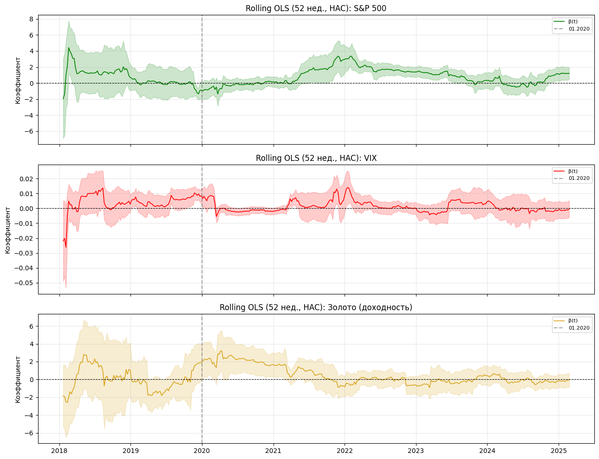
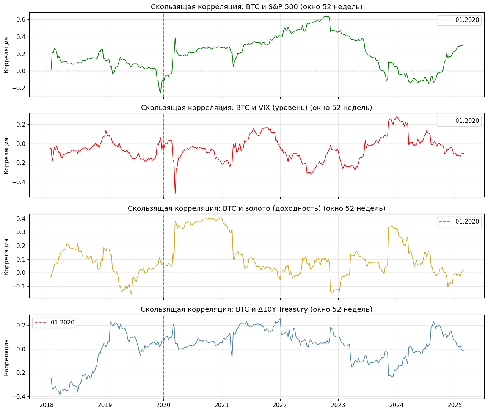
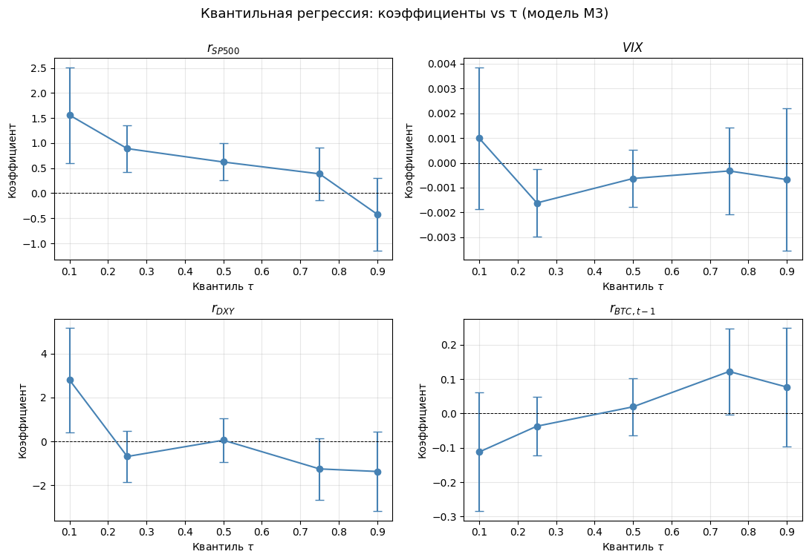
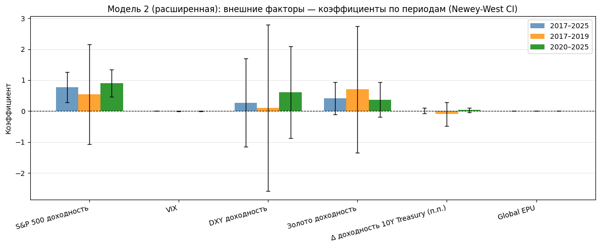

# 3 Эмпирические результаты

В настоящей главе представлены результаты эконометрического анализа факторов недельной доходности Bitcoin за 2017–2025 годы. Сначала приводятся результаты базовых OLS-оценок на полном периоде; затем следуют сравнение подпериодов и интерпретация гипотез, проверки устойчивости (GARCH, rolling window, квантильная регрессия) и обсуждение содержательного смысла полученных результатов.

## 3.1 Базовые OLS-результаты: полный период

**Сравнение объясняющей силы моделей.** На первом этапе все четыре спецификации (М1–М4) оценены на полном периоде 2017–2025 (n = 422) методом наименьших квадратов с HAC-стандартными ошибками (Newey–West, h = 5). Сводные показатели объясняющей силы приведены в таблице 3.1.

*Таблица 3.1 — Сравнение объясняющей силы моделей, полный период 2017–2025*

| Модель | Спецификация | n | R² | Adj. R² |
| --- | --- | ---: | ---: | ---: |
| М1 | Крипто-специфические | 422 | 0,0092 | 0,0021 |
| М2 | Внешние рыночные | 422 | 0,0441 | 0,0373 |
| М3 | Все факторы | 422 | 0,0476 | 0,0338 |
| М4 | Расширенная (М3 + золото, Δ10Y, EPU) | 422 | 0,0522 | 0,0315 |

Блок внешних рыночных факторов (М2) объясняет доходность Bitcoin заметно лучше, чем крипто-специфический блок (М1): скорректированный R² составил 0,0373 против 0,0021 соответственно. Переход от М2 к полной модели М3 добавляет лишь 0,0035 к R², тогда как adj. R² снижается с 0,0373 до 0,0338, что отражает «штраф» за включение незначимых крипто-специфических переменных. Расширенная модель М4 даёт ещё меньший adj. R² — 0,0315: добавление трёх контрольных макрофакторов (золото, изменение доходности 10Y Treasury, глобальный EPU) увеличивает R² лишь на 0,0046 при цене трёх дополнительных степеней свободы. Уже на уровне сводных показателей гипотеза H1 о доминировании крипто-специфического блока не получает подтверждения, а расширение спецификации не приносит дополнительной объясняющей ценности относительно М2.

Следует оговориться, что абсолютные значения R² остаются умеренными по сравнению с традиционными финансовыми активами. Это типично для еженедельных данных по активам с высокой идиосинкратической волатильностью и не снижает содержательности сравнения двух блоков переменных.

**Коэффициенты и их значимость.** Детальные результаты оценок для всех трёх спецификаций приведены в таблице 3.2.

*Таблица 3.2 — Результаты OLS-оценки с HAC-стандартными ошибками, полный период 2017–2025*

| Переменная | М1 | М1 p | М2 | М2 p | М3 | М3 p |
| --- | ---: | ---: | ---: | ---: | ---: | ---: |
| Константа | 0,045 | 0,272 | 0,021 | 0,162 | 0,030 | 0,425 |
| $r_{BTC,t-1}$ | 0,069 | 0,157 | — | — | 0,029 | 0,580 |
| $\ln V_{BTC}$ | −0,003 | 0,256 | — | — | −0,001 | 0,555 |
| $GT$ | 0,0002 | 0,658 | — | — | 0,0002 | 0,560 |
| $r_{SP500}$ | — | — | **0,793** | **0,001** | **0,776** | **0,001** |
| $VIX$ | — | — | −0,001 | 0,380 | −0,001 | 0,487 |
| $r_{DXY}$ | — | — | −0,091 | 0,893 | −0,062 | 0,927 |
| R² | 0,0092 | | 0,0441 | | 0,0476 | |
| Adj. R² | 0,0021 | | 0,0373 | | 0,0338 | |

*Примечание: полужирным выделены коэффициенты, значимые на уровне 5%.*

Единственной переменной, устойчиво значимой на всём периоде, выступает доходность S&P 500: коэффициент равен 0,793 в М2 и 0,776 в М3 (p = 0,001 в обоих случаях). Это означает, что рост S&P 500 на 1 п.п. сопровождается ростом доходности Bitcoin примерно на 0,79 п.п. в среднем. Положительный знак коэффициента согласуется с интерпретацией Bitcoin как рискового актива, чувствительного к глобальному риск-аппетиту.

Переменные $VIX$ и $r_{DXY}$ демонстрируют ожидаемые знаки (отрицательные), однако не достигают стандартных уровней значимости. Крипто-специфические переменные (лаг доходности, объём торгов, Google Trends) также незначимы ни в М1, ни в М3. Результат согласуется с выводами Шилова и Зубарева (2021): на агрегированном горизонте 2017–2025 внутренние факторы не являются устойчивыми предикторами доходности Bitcoin.

## 3.2 Сравнение подпериодов: проверка гипотез H2a и H2b

**Объясняющая сила по периодам.** Для проверки гипотез о временно́й динамике факторной структуры все три модели оценены раздельно для подпериодов 2017–2019 (n = 153) и 2020–2025 (n = 269). Сравнение adj. R² представлено в таблице 3.3.

*Таблица 3.3 — Скорректированный R² по моделям и подпериодам*

| Модель | Полный период | 2017–2019 | 2020–2025 |
| --- | ---: | ---: | ---: |
| М1: крипто-специфические | 0,0021 | −0,0104 | 0,0134 |
| М2: внешние рыночные | 0,0373 | −0,0004 | 0,0789 |
| М3: все факторы | 0,0338 | −0,0153 | 0,0810 |
| М4: расширенная | 0,0315 | −0,0170 | 0,0823 |

В подпериоде 2017–2019 ни одна из моделей не обладает содержательной объясняющей силой: adj. R² отрицателен для всех трёх спецификаций, что указывает на то, что на раннем этапе рынка включённый набор факторов не отражает устойчивых линейных зависимостей.

В подпериоде 2020–2025 картина принципиально меняется. Adj. R² модели М2 возрастает до 0,0789, что соответствует росту на 7,9 п.п. по сравнению с первым подпериодом. Adj. R² модели М1 также становится положительным (0,0134), однако значительно уступает М2. Разрыв между блоками во втором подпериоде (0,0789 − 0,0134 = 0,066) существенно превышает таковой на полном периоде (0,0373 − 0,0021 = 0,035), что свидетельствует об усилении относительного доминирования внешних факторов.

Гипотеза H2a о росте adj. R² модели М2 в подпериоде 2020–2025 по сравнению с 2017–2019 **подтверждается** с большим запасом.

Гипотеза H2b в принятой формулировке («относительный разрыв в adj. R² между внешним и крипто-специфическим блоками в зрелом подпериоде расширяется») также **подтверждается**: разрыв вырос с 1,00 п.п. в раннем подпериоде до 6,55 п.п. в зрелом. При этом в абсолютном выражении adj. R² М1 не снизился, а слегка вырос (с −0,0104 до 0,0134) за счёт появления умеренного momentum-эффекта, отражённого в коэффициентах таблицы 3.4. Содержательная картина прозрачна: крипто-специфический блок не утратил объясняющую силу в абсолютном выражении, но в относительном уступил место внешним факторам.

**Коэффициенты по подпериодам.** Детальные оценки уточнить механизм наблюдаемых изменений. Ключевые результаты приведены в таблице 3.4.

*Таблица 3.4 — Коэффициенты ключевых переменных по подпериодам (МНК с HAC)*

| Переменная | 2017–2019 | p | 2020–2025 | p |
| --- | ---: | ---: | ---: | ---: |
| **М2: внешние факторы** | | | | |
| $r_{SP500}$ | 0,319 | 0,658 | **0,964** | < 0,001 |
| $VIX$ | −0,003 | 0,215 | −0,0002 | 0,721 |
| $r_{DXY}$ | −0,727 | 0,581 | 0,342 | 0,632 |
| **М1: крипто-специфические** | | | | |
| $r_{BTC,t-1}$ | 0,003 | 0,963 | **0,129** | **0,024** |
| $\ln V_{BTC}$ | −0,010 | 0,274 | −0,002 | 0,491 |
| $GT$ | 0,0004 | 0,677 | 0,0002 | 0,578 |

*Примечание: полужирным выделены коэффициенты, значимые на уровне 5%.*

Коэффициент при $r_{SP500}$ вырос с 0,319 (незначимо, p = 0,658) в раннем периоде до 0,964 (p < 0,001) в зрелом периоде. Это троекратное увеличение коэффициента и переход к высокой статистической значимости является центральным эмпирическим результатом работы. Сравнение коэффициентов внешних факторов по подпериодам визуализировано на рисунке 3.1.

*Рисунок 3.1 — Коэффициенты внешних факторов в подпериодах 2017–2019 и 2020–2025*

Примечательно, что в подпериоде 2020–2025 появился статистически значимый momentum-эффект: коэффициент при $r_{BTC,t-1}$ в М1 равен 0,129 (p = 0,024). В раннем периоде этот коэффициент практически равен нулю (0,003, p = 0,963). Возможны две содержательные интерпретации этого результата. Первая — постепенное включение информации в цену на зрелом рынке с высоким оборотом, при котором недельная автокорреляция доходностей отражает запаздывающее обновление котировок. Вторая — эффект институциональных покупок крупными траншами (MicroStrategy с августа 2020 года, Tesla с февраля 2021 года, выход спотовых Bitcoin ETF в 2024 году), при котором серии однонаправленных сделок крупных игроков порождают локальную автокорреляцию доходностей. Различение этих двух механизмов требует отдельного исследования с поминутными данными или прокси институционального участия. Что важно для настоящей работы, в обоих случаях рост momentum в сочетании с усилением связи с S&P 500 говорит о том, что Bitcoin начал вести себя как типичный рисковый актив, чувствительный к крупным потокам капитала.

**Тест на статистическую значимость различия коэффициентов.** Сравнение точечных оценок коэффициентов между подпериодами оставляет открытым вопрос: являются ли наблюдаемые различия (например, 0,32 → 0,96 для $r_{SP500}$) статистически значимыми, или они укладываются в стандартную ошибку оценок раннего подпериода. Для формальной проверки построена t-статистика на равенство коэффициентов:

$$
t = \frac{\hat{\beta}_2 - \hat{\beta}_1}{\sqrt{SE_1^2 + SE_2^2}}
$$

распределённая при нулевой гипотезе $H_0: \beta_1 = \beta_2$ как $t(n_1 + n_2 - 2k)$. Здесь $\hat{\beta}_j$ и $SE_j$ — оценки и HAC-стандартные ошибки коэффициента в подпериоде $j$. Результаты для модели М3 представлены в таблице 3.5.

*Таблица 3.5 — Тест на равенство коэффициентов в подпериодах 2017–2019 и 2020–2025, модель М3*

| Параметр | $\hat{\beta}_1$ | $\hat{\beta}_2$ | $\hat{\beta}_2 - \hat{\beta}_1$ | $SE_{\Delta}$ | $t$ | p |
| --- | ---: | ---: | ---: | ---: | ---: | ---: |
| $r_{BTC,t-1}$ | −0,026 | 0,074 | +0,099 | 0,099 | 1,01 | 0,315 |
| $\ln V_{BTC}$ | −0,007 | −0,001 | +0,006 | 0,008 | 0,73 | 0,469 |
| $GT$ | 0,0003 | 0,0003 | +0,000 | 0,001 | 0,02 | 0,988 |
| $r_{SP500}$ | 0,339 | 0,951 | +0,612 | 0,771 | 0,79 | 0,428 |
| $VIX$ | −0,003 | 0,000 | +0,003 | 0,003 | 1,17 | 0,242 |
| $r_{DXY}$ | −0,611 | 0,401 | +1,012 | 1,550 | 0,65 | 0,514 |

*Примечание: степени свободы $n_1 + n_2 - 2k = 408$. Критические значения $|t|$: 10% — 1,649; 5% — 1,966; 1% — 2,588.*

Ни для одного из коэффициентов модели М3 нулевая гипотеза о равенстве в подпериодах не отвергается на уровне 10%. Для ключевой переменной работы $r_{SP500}$ t-статистика составила 0,79 при p = 0,43.

Результат согласуется с результатами тестов Чоу и Quandt-Andrews (таблица 2.7) и допускает прозрачную интерпретацию. В подпериоде 2017–2019 стандартная ошибка коэффициента при $r_{SP500}$ составляет 0,74 — на порядок выше, чем во втором подпериоде (0,22). Высокая остаточная волатильность доходностей Bitcoin в раннем периоде поглощает разницу в средних оценках, лишая тест способности зафиксировать структурное различие. Низкая мощность теста на различие коэффициентов при умеренной выборке первого подпериода ($n_1 = 153$) и высокой шумовой компоненте является типичной чертой эмпирических исследований доходностей криптовалют.

Содержательно более информативным признаком сдвига выступает не статистическое отличие точечных оценок коэффициентов, а одновременное изменение трёх характеристик модели: рост adj. R² модели М2 с −0,0004 до 0,0789 (таблица 3.3), переход коэффициента при $r_{SP500}$ от незначимого (p = 0,658 при $\hat{\beta}_1 = 0{,}319$) к высокозначимому ($p < 0{,}001$ при $\hat{\beta}_2 = 0{,}964$) и появление значимого momentum-эффекта в зрелом подпериоде. Совокупность этих признаков указывает на качественное изменение факторной структуры, которое формальный тест Чоу не в состоянии разделить с шумом, но которое отчётливо просматривается в сравнительном анализе.

## 3.3 Проверка устойчивости: GARCH(1,1)

Наличие ARCH-эффектов в остатках OLS-моделей, выявленное при диагностике предпосылок во второй главе, мотивирует оценку GARCH(1,1) как проверки устойчивости. Уравнение среднего соответствует спецификации М3; уравнение дисперсии задано формулой (2.8). Результаты GARCH-оценки для полного периода приведены в таблице 3.6.

*Таблица 3.6 — Результаты GARCH(1,1), М3, полный период 2017–2025*

| Переменная | Коэффициент | p-значение |
| --- | ---: | ---: |
| $r_{BTC,t-1}$ | 0,041 | 0,456 |
| $\ln V_{BTC}$ | −0,0001 | 0,973 |
| $GT$ | 0,0004 | 0,149 |
| **$r_{SP500}$** | **0,857** | **< 0,001** |
| $VIX$ | −0,0004 | 0,644 |
| $r_{DXY}$ | 0,213 | 0,748 |
| $\omega$ | 0,000 | — |
| $\alpha_1$ | 0,012 | 0,751 |
| $\beta_1$ | **0,984** | **< 0,001** |

*Примечание: уравнение среднего; коэффициенты пересчитаны к исходному масштабу переменных.*

Единственной значимой переменной в уравнении среднего остаётся $r_{SP500}$ (p < 0,001, коэффициент 0,857), что практически совпадает с OLS-оценкой 0,776 в той же спецификации М3 (см. таблицу 3.2). Уравнение дисперсии характеризуется высокой устойчивостью условной волатильности: $\beta_1 = 0,984$ при p < 0,001, тогда как параметр ARCH $\alpha_1 = 0,012$ незначим: волатильность Bitcoin определяется преимущественно собственной инерцией.

Среди незначимых переменных обращает на себя внимание смена знака $r_{DXY}$ по сравнению с OLS (в OLS: −0,091, в GARCH: +0,213). Оба значения статистически неотличимы от нуля (p > 0,70), поэтому содержательных выводов из этого расхождения делать не следует: оно отражает неустойчивость незначимого коэффициента при смене метода оценивания.

В подпериоде 2020–2025 коэффициент при $r_{SP500}$ в GARCH-спецификации составил 1,078 (p < 0,001, отдельная таблица не приводится), что близко к OLS-оценке 0,964. В подпериоде 2017–2019 ни один регрессор не значим ни в GARCH, ни в OLS-модели.

Динамика оценённой условной волатильности представлена на рисунке 3.2. На нём хорошо видны периоды повышенной неопределённости: конец 2017 — начало 2018 года (пик рыночного пузыря), март 2020 года (COVID-шок) и конец 2022 года (крах FTX).

*Рисунок 3.2 — Условная волатильность Bitcoin, оценённая по GARCH(1,1), 2017–2025*

Переход от OLS к GARCH(1,1) не меняет содержательных выводов: $r_{SP500}$ остаётся единственным устойчиво значимым детерминантом, что повышает доверие к базовым результатам.

## 3.4 Rolling window: динамика коэффициентов во времени

Для непосредственного наблюдения за трансформацией факторной структуры применён метод скользящего окна шириной 52 недели с шагом одна неделя. В каждом из 371 скользящего окна оценивалась модель М3; результирующие ряды коэффициентов при $r_{SP500}$ и $r_{BTC,t-1}$ отображены на рисунке 3.3.

*Рисунок 3.3 — Скользящие коэффициенты при $r_{SP500}$ и $r_{BTC,t-1}$, окно 52 недели*

Средний коэффициент при $r_{SP500}$ в окнах, заканчивающихся до 2020 года, составил 0,662; в окнах после 2020 года он составил 0,977. Этот сдвиг устойчив и не сводится к нескольким аномальным периодам: медианное значение коэффициента также выросло в более позднем периоде. Рисунок 3.3 наглядно показывает, что связь Bitcoin с фондовым рынком претерпела структурное изменение около 2020 года, а не менялась постепенно в течение всей выборки.

Скользящие корреляции $r_{BTC}$ с четырьмя ключевыми внешними переменными (S&P 500, VIX, золото, изменение доходности 10Y Treasury) представлены на рисунке 3.4. Корреляция с $r_{SP500}$ устойчиво возросла после 2020 года и сохраняет положительные значения на большей части зрелого подпериода. Корреляция с $VIX$ менее устойчива и нередко меняет знак, что согласуется с незначимостью VIX в регрессионных оценках. Корреляция с доходностью золота волатильна, не имеет устойчивого знака и колеблется вокруг нуля, что согласуется с незначимостью $r_{gold}$ в расширенной модели М4. Скользящая корреляция с $\Delta y^{10y}$ также не демонстрирует устойчивого направления связи, что подтверждает результат М4 о незначимости этой переменной.

*Рисунок 3.4 — Скользящая корреляция $r_{BTC}$ с $r_{SP500}$, $VIX$, доходностью золота и $\Delta y^{10y}$, окно 52 недели*

## 3.5 Квантильная регрессия: неоднородность влияния факторов

Квантильная регрессия позволяет проверить, является ли связь Bitcoin с $r_{SP500}$ однородной вдоль распределения доходности или она концентрируется в определённых режимах рынка. Модель М3 оценена для пяти квантилей ($\tau \in \{0{,}10;\, 0{,}25;\, 0{,}50;\, 0{,}75;\, 0{,}90\}$) на полном периоде. Результаты по ключевым переменным представлены в таблице 3.7.

*Таблица 3.7 — Квантильные коэффициенты при $r_{SP500}$ и $r_{BTC,t-1}$, полный период*

| Квантиль $\tau$ | Коэф. $r_{SP500}$ | p | Коэф. $r_{BTC,t-1}$ | p |
| ---: | ---: | ---: | ---: | ---: |
| 0,10 | **1,558** | **0,001** | −0,112 | 0,202 |
| 0,25 | **0,890** | **< 0,001** | −0,037 | 0,395 |
| 0,50 | **0,622** | **0,001** | 0,019 | 0,649 |
| 0,75 | 0,386 | 0,148 | 0,122 | 0,056 |
| 0,90 | −0,420 | 0,257 | 0,077 | 0,382 |

Результаты таблицы 3.7 обнаруживают выраженную асимметрию влияния внешних факторов. Коэффициент при $r_{SP500}$ значим и положителен в нижних квантилях (τ = 0,10; 0,25; 0,50), тогда как при переходе к верхним квантилям он снижается и теряет значимость, достигая отрицательного незначимого значения при τ = 0,90. Таким образом, связь Bitcoin с фондовым рынком проявляется прежде всего в периоды падений: когда S&P 500 снижается, Bitcoin падает пропорционально сильнее. Этот результат согласуется с выводами Lin, Liu и Sheng (2025) об асимметрии хвостовой зависимости. Conlon и McGee (2020) на данных COVID-19 эмпирически подтвердили, что Bitcoin не выступает защитным активом в периоды рыночного стресса.

Рисунок 3.5 визуализирует весь спектр квантильных коэффициентов.

*Рисунок 3.5 — Квантильные коэффициенты при $r_{SP500}$ и других переменных*

## 3.6 Расширенная модель М4: проверка устойчивости

Для проверки устойчивости полученных выводов к включению дополнительных макроэкономических контрольных факторов оценена расширенная модель М4. К набору регрессоров М3 добавляются недельная доходность золота $r_{gold}$, изменение доходности 10-летних казначейских облигаций США $\Delta y^{10y}$ и глобальный индекс экономической политической неопределённости $EPU$. Спецификация (2.6) оценена методом OLS с HAC-стандартными ошибками на полном периоде и в обоих подпериодах. Результаты приведены в таблице 3.8.

*Таблица 3.8 — Результаты OLS-оценки модели М4 (расширенная) с HAC-стандартными ошибками*

| Переменная | Полный период | p | 2017–2019 | p | 2020–2025 | p |
| --- | ---: | ---: | ---: | ---: | ---: | ---: |
| Константа | 0,032 | 0,401 | 0,143 | 0,204 | −0,006 | 0,885 |
| $r_{BTC,t-1}$ | 0,030 | 0,535 | −0,026 | 0,721 | 0,066 | 0,310 |
| $\ln V_{BTC}$ | −0,002 | 0,561 | −0,003 | 0,712 | −0,002 | 0,441 |
| $GT$ | 0,0002 | 0,631 | 0,0004 | 0,680 | 0,0003 | 0,470 |
| $r_{SP500}$ | **0,753** | **0,003** | 0,552 | 0,502 | **0,894** | **< 0,001** |
| $VIX$ | −0,001 | 0,453 | −0,003 | 0,219 | −0,0003 | 0,742 |
| $r_{DXY}$ | 0,298 | 0,688 | 0,120 | 0,931 | 0,679 | 0,372 |
| $r_{gold}$ | 0,406 | 0,137 | 0,632 | 0,568 | 0,376 | 0,189 |
| $\Delta y^{10y}$ | 0,012 | 0,786 | −0,099 | 0,617 | 0,034 | 0,360 |
| $EPU$ | −0,00003 | 0,987 | −0,0003 | 0,164 | 0,0001 | 0,256 |
| n | 422 | | 153 | | 269 | |
| R² | 0,052 | | 0,043 | | 0,113 | |
| Adj. R² | 0,032 | | −0,017 | | 0,082 | |

*Примечание: полужирным выделены коэффициенты, значимые на уровне 5%.*

Сравнение коэффициентов внешних факторов расширенного блока по подпериодам визуализировано на рисунке 3.6.

*Рисунок 3.6 — Коэффициенты расширенного внешнего блока в подпериодах 2017–2019 и 2020–2025*

Содержательно результаты М4 подтверждают устойчивость основных выводов работы. Во-первых, ни одна из трёх дополнительных переменных не достигает уровня значимости 10% ни на полном периоде, ни в каком-либо из подпериодов. Коэффициент при $r_{gold}$ положителен и наиболее близок к значимости (p = 0,137 на полном периоде), что качественно согласуется с гипотезой о частичной поддержке нарратива о Bitcoin как «цифровом золоте» (Pourpourides, 2025), однако в строгом статистическом смысле эта гипотеза не подтверждается. Коэффициент при $\Delta y^{10y}$ незначим во всех спецификациях. Коэффициент при $EPU$ принимает противоположные знаки в подпериодах (отрицательный в раннем, положительный в зрелом), но также остаётся статистически неотличимым от нуля.

Во-вторых, ключевой результат работы — устойчивая значимость коэффициента при $r_{SP500}$ — сохраняется и в М4. На полном периоде коэффициент составил 0,753 (p = 0,003), что близко к OLS-оценке М3 (0,776, p = 0,001). В зрелом подпериоде 2020–2025 коэффициент равен 0,894 (p < 0,001), что находится в пределах статистической погрешности от оценки М3 (0,964 при p < 0,001) и согласуется с GARCH-оценкой 1,078. Качественно картина одинакова: $r_{SP500}$ переходит от незначимого в раннем подпериоде к высокозначимому в зрелом, в то время как остальные внешние факторы остаются незначимыми.

В-третьих, в первом подпериоде (n = 153) расширенная модель имеет отрицательный adj. R² (−0,017), тогда как в зрелом подпериоде adj. R² незначительно превышает значение М3 (0,082 против 0,081). Это согласуется с теоретическим ожиданием: при ограниченной выборке добавление девяти регрессоров приводит к переобучению, тогда как на больших выборках штраф за дополнительные степени свободы компенсируется небольшим приростом R². Сводные показатели adj. R² для М4 включены в таблицу 3.3.

В целом расширенная спецификация подтверждает, что основной вывод работы — доминирование внешних рыночных факторов и устойчивая значимость доходности S&P 500 — не зависит от выбора набора контрольных переменных. Дополнительные макроэкономические факторы (золото, изменение доходности 10Y Treasury, глобальный EPU) не привносят дополнительной объясняющей ценности и не меняют качественных выводов работы.

## 3.7 Обсуждение результатов

**Проверка гипотез.** Гипотеза H1 отвергается: adj. R² модели М2 (0,037) в 18 раз превышает adj. R² модели М1 (0,002) на полном периоде. Гипотеза H2a подтверждается с большим запасом: adj. R² модели М2 вырос с −0,0004 до 0,0789. Гипотеза H2b (в формулировке о расширении относительного разрыва между блоками) также подтверждается: разрыв adj. R² между М2 и М1 вырос с 1,0 п.п. в раннем подпериоде до 6,6 п.п. в зрелом. При этом тесты Чоу и Quandt-Andrews на формальное равенство всех коэффициентов модели в подпериодах не отвергают нулевую гипотезу о стабильности (таблицы 2.7 и 3.5), что отражает низкую мощность тестов на различие при умеренной выборке первого подпериода и высокой остаточной волатильности недельных доходностей Bitcoin.

**Роль S&P 500.** Доходность фондового рынка США является единственным устойчиво значимым детерминантом Bitcoin на всём горизонте и в зрелом периоде в особенности. Коэффициент при $r_{SP500}$ вырос с незначимых 0,32 в 2017–2019 годах до 0,96 в 2020–2025 годах. Этот результат устойчив к выбору метода оценивания (OLS, GARCH, расширенная М4), горизонту (rolling window) и квантилю распределения. В расширенной модели М4 с тремя дополнительными контрольными переменными коэффициент при $r_{SP500}$ составил 0,75 (p = 0,003) на полном периоде и 0,89 (p < 0,001) в зрелом подпериоде, что находится в пределах статистической погрешности от оценок М3. Содержательная интерпретация однозначна: Bitcoin функционирует как рисковый актив, тесно следующий за глобальным риск-аппетитом.

**Незначимость VIX и DXY.** В контексте имеющейся литературы этот результат неочевиден. Отрицательная связь Bitcoin с VIX зафиксирована в нескольких работах (Tzeng, Su, 2024), однако на недельных данных эффект поглощается доходностью S&P 500, с которой VIX скоррелирован (r = −0,20). Прямая проверка подтверждает поглощение: коэффициент при VIX в спецификации без $r_{SP500}$ составил −0,00103 (p = 0,205), тогда как при включении $r_{SP500}$ — лишь −0,00061 (p = 0,378). Аналогичная ситуация наблюдается и для DXY: оценка коэффициента при $r_{DXY}$ в М2 без $r_{SP500}$ составляет −0,966 (p = 0,101), а при включении $r_{SP500}$ снижается по модулю до −0,091 (p = 0,893). Незначимость $r_{DXY}$ в полной модели согласуется с Pourpourides (2025): влияние доллара может реализовываться преимущественно через нелинейные или асимметричные каналы, частично перекрывающиеся с эффектом фондового рынка.

В обратном направлении исключение $r_{DXY}$ из М2 практически не меняет коэффициент при $r_{SP500}$: 0,807 (p < 0,001) против 0,793 в полной М2. Это подтверждает, что устойчивость оценки $r_{SP500}$ не зависит от присутствия DXY, и снимает потенциальный аргумент о необходимости отбросить $r_{DXY}$ из-за корреляции с $r_{SP500}$ (r = −0,419 по таблице 2.4).

**Ограничения исследования.** Максимальный adj. R² на рассматриваемом горизонте составил 8,1% (М3 в 2020–2025). Значительная часть дисперсии доходности Bitcoin остаётся необъяснённой. Это не является аномалией: для еженедельных доходностей высоковолатильных активов подобные уровни типичны (Liu, Tsyvinski, 2021). Настоящая работа сосредоточена на сравнительном анализе двух блоков факторов, а не на построении прогностической модели с максимальным R². Дополнительным ограничением служит линейность всех спецификаций: нелинейные режимные модели могут обеспечить более высокое качество подгонки, однако за счёт снижения интерпретируемости сравнительных результатов.

Эмпирический анализ на недельных данных 2017–2025 годов позволил получить следующие основные результаты. На полном периоде внешний рыночный блок обладает большей объясняющей силой, чем крипто-специфический (adj. R² 0,037 против 0,002), что соответствует отклонению гипотезы H1. Единственным устойчиво значимым детерминантом Bitcoin на всём горизонте выступает доходность S&P 500 (p = 0,001 в OLS, p < 0,001 в GARCH, p = 0,003 в расширенной М4). Сравнение подпериодов выявило структурное изменение факторной структуры: adj. R² модели с внешними факторами вырос с −0,000 в 2017–2019 годах до 0,079 в 2020–2025 годах, а коэффициент при $r_{SP500}$ вырос с 0,32 (незначимо) до 0,96 (p < 0,001), что подтверждает гипотезу H2a. Метод скользящего окна зафиксировал устойчивый структурный сдвиг около 2020 года. Квантильная регрессия обнаружила асимметрию: связь Bitcoin с S&P 500 концентрируется в нижних квантилях доходности, то есть в периоды рыночных падений. GARCH(1,1) и расширенная модель М4 с дополнительными контрольными факторами (золото, изменение доходности 10Y Treasury, глобальный EPU) подтвердили устойчивость всех ключевых выводов относительно базовой OLS-спецификации.
